# DLaaSWorkshop
# Table of Contents
1. [Provision IBM Cloud Services](#provision)
2. [Create Watson Studio Project / Connect Services](#create)
3. [Add Data](#add)
4. [Build Neural Networks](#build)
	1. [With Neural Network Modeler](#wnnm1)
	2. [With Keras](#wkeras)
5. [Run Experiments](#run)
	1. [With Neural Network Modeler](#wnnm2)
	2. [With Hyperparameter Optimization](#whpo)

## Provision IBM Cloud Services  

Sign into IBM Cloud to see the welcome page below. New services are provisioned by selecting “Catalog.” Search for and select “Watson Studio.”

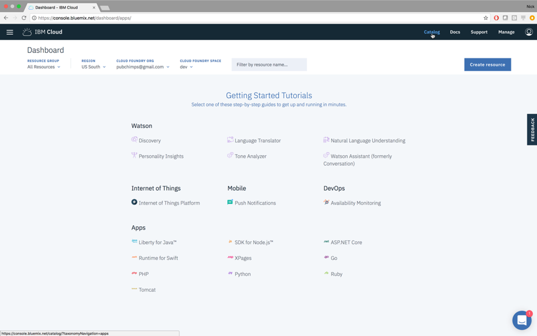
 

Make sure that a Lite plan is being selected for all services. Click “Create,” then search for and add Lite “Machine Learning” and “Object Storage” services in the Catalog. Once finished, the IBM Cloud logo in the top left should bring you to a page shown below.

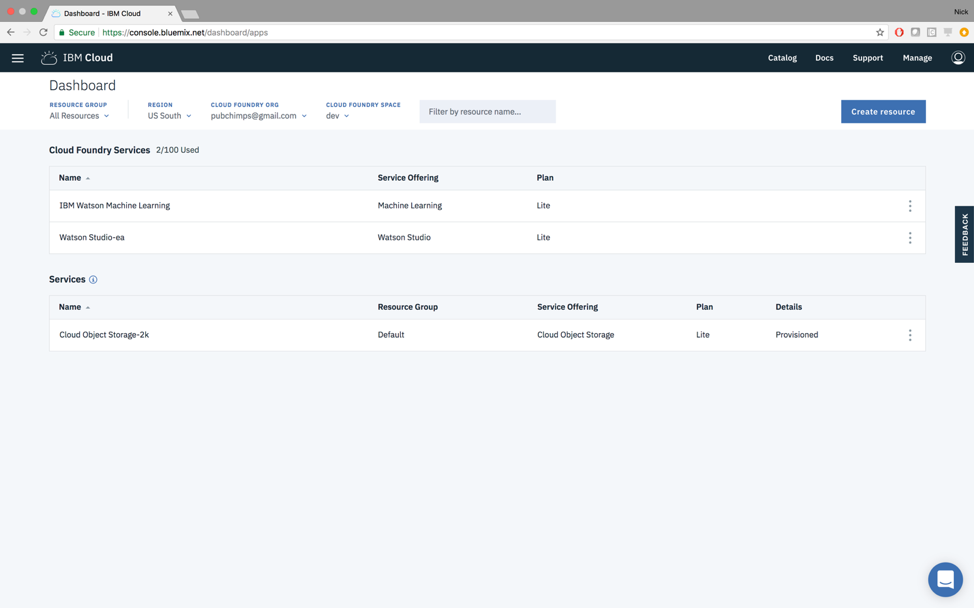

## Create Watson Studio Project / Connect Services 

Now a new Watson Studio Project will be created that utilizes all the IBM Cloud services just provisioned. Access Watson Studio by selecting the created Watson Studio service from the IBM Cloud dashboard, then select “Get Started” click through prompts. Once in Watson Studio select “New project” on the right. The type of project needed is “Complete.”

Name the new project “DLaaS Workshop.” The IBM Cloud Object Storage service that was provisioned is already associated with our project. Select “Create” at the bottom right.

Once the new project is created, select “Settings” in the far-right of the top menu. Scroll down until “Associated services” is visible and under “Add service” select “Machine Learning” to add the existing Watson Machine Learning service that was provisioned. Now all over the services are associated with each other in the Watson Studio project and are ready for Deep Learning models.

## Add Data 

Buckets will now be created in the IBM Cloud Object storage service to so that the mnist training data and the results of deep learning training algorithms can be stored. The data is loaded in two different formats, demonstrated in “AddMNistData.ipynb”. Under assets, we will add a “New notebook” and point it to the notebook hosted on GitHub while keeping the default runtime already specified.

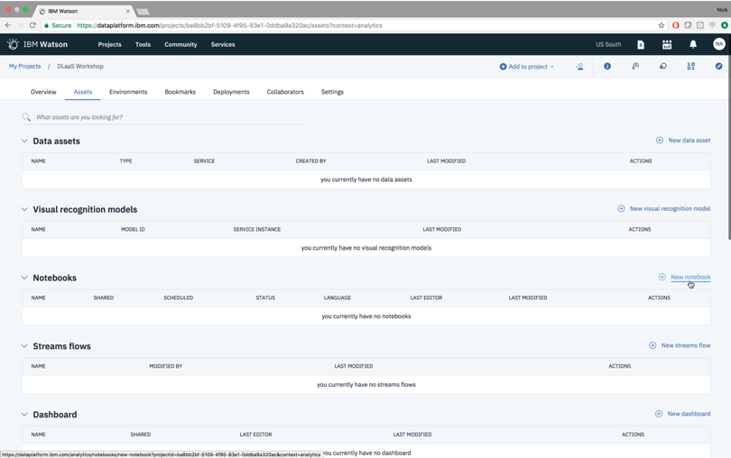
 

## Build Neural Networks 

Two neural networks will be created, a convolutional neural network (cnn) by using Watson Studio’s Neural Network Modeler along with a multilayer perceptron (mlp) in Keras.

### With Neural Network Modeler 
The steps to create a cnn using Neural Network Modeler are shown in the following annotated images.

| 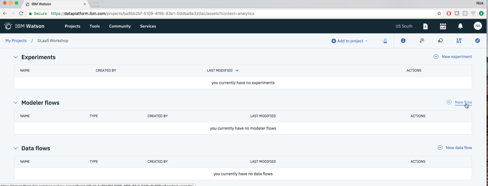 | 
|:--:| 
| *In the “Assets” section of the “DLaaS Workshop” project, scroll and select “New Flow” from “Modeler flows”* |

| 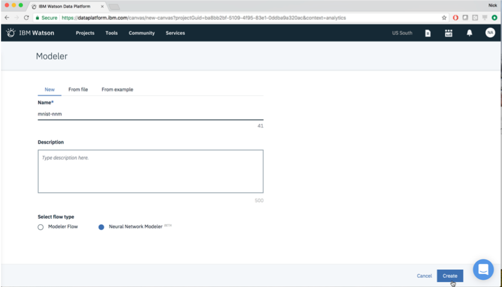 | 
|:--:| 
| *Name the new model “mnist-nnm” and select “Neural Network Modeler” as the flow type. Then select “Create”* |

| 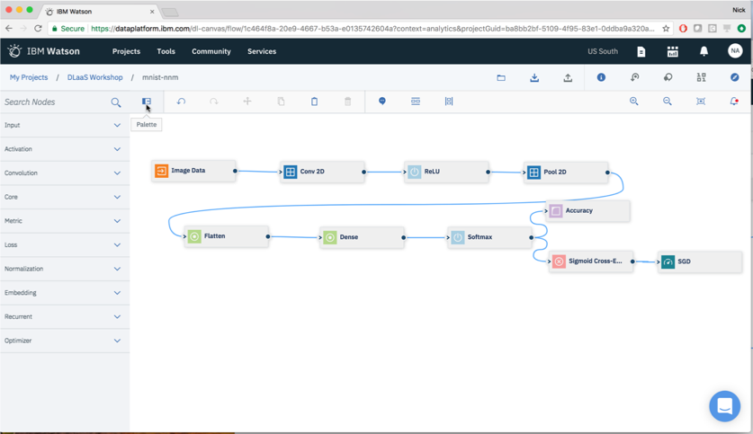 | 
|:--:| 
| *Use the Palette to the left to add the 10 neural network nodes shown above and connect them as follows.* |

Now the nodes must be configured for the mnist data, a node’s settings are visible by double-clicking it or selecting ⋮ then “open.”

|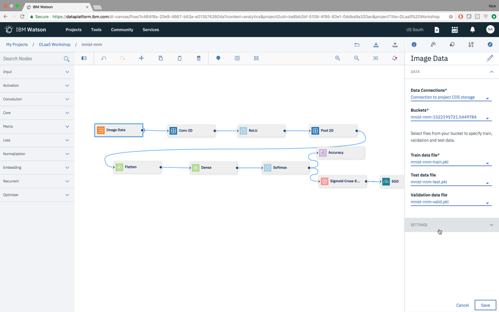 | 
|:--:| 
| *Edit the “Data” section to point to the pickle object that were created and stored in the mnist-nnm-… bucket from AddMnistData Notebook, then select “Settings”* |

|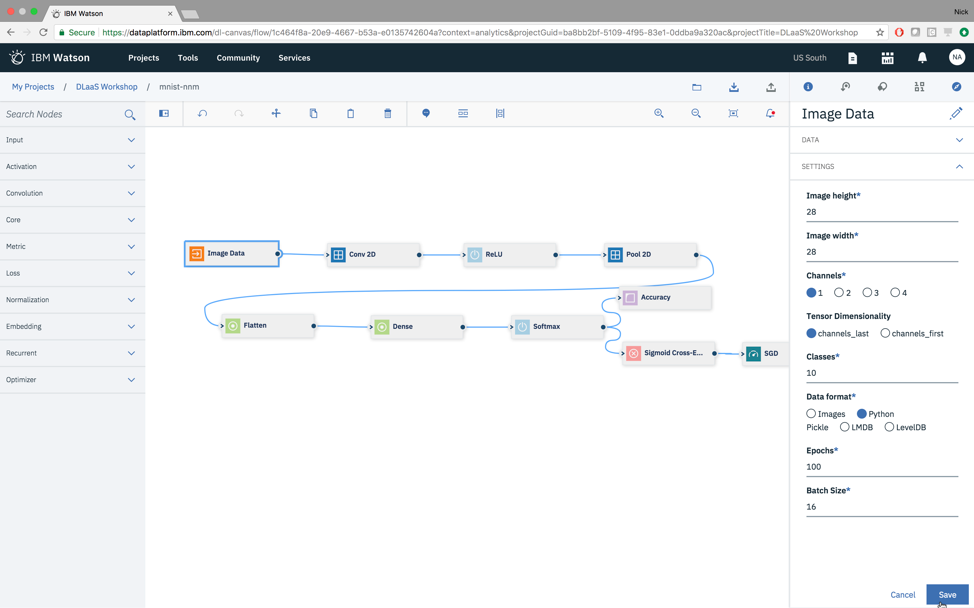 | 
|:--:| 
| *Configure the “Image Data” settings. Images are 28x28, 10 classes and are in “Python Pickle” format. Then select “Save”* |

|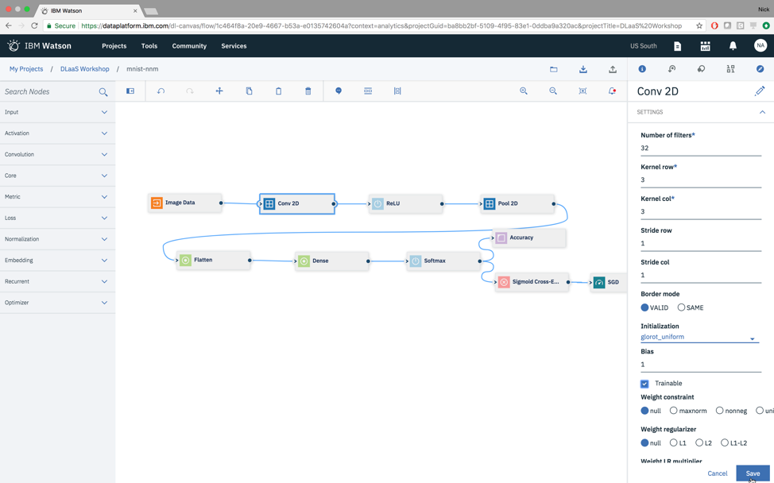 | 
|:--:| 
| *The settings for the “Conv 2D” layer are on the left. The settings that cannot be seen in the screenshot are left to default.* |

|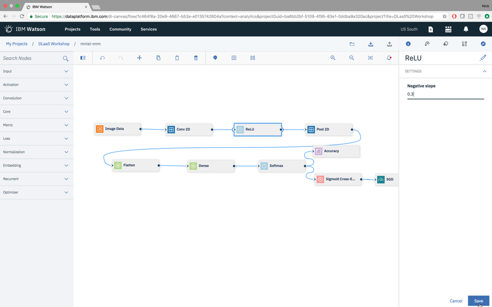 | 
|:--:| 
| *The “ReLU” activation layer will have a “Negative slope” of 0.3* |

| | 
|:--:| 
| *The “Pool 2D” settings. Make sure the “Trainable” box is checked for this node and the “Conv 2D” node* |

|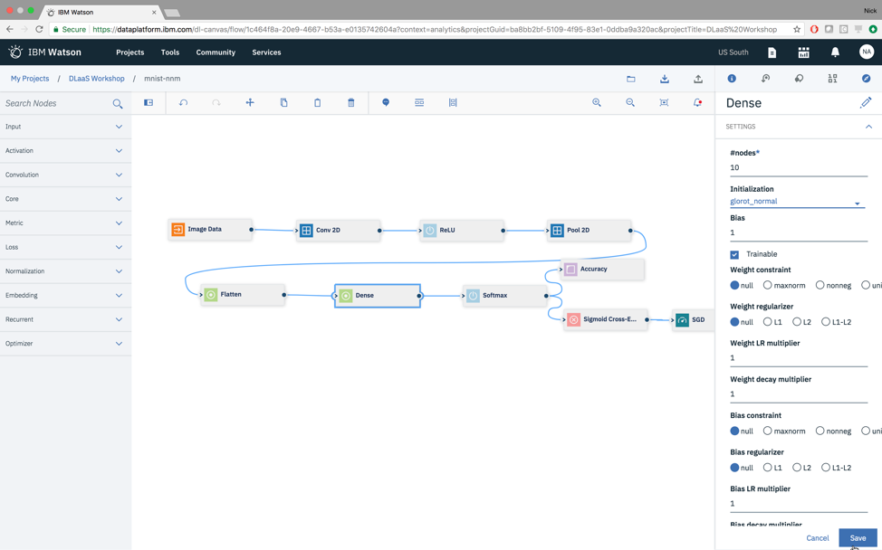 | 
|:--:| 
| *The “Dense” node here must have the same number of nodes as classes in the data, in this case 10.* |

|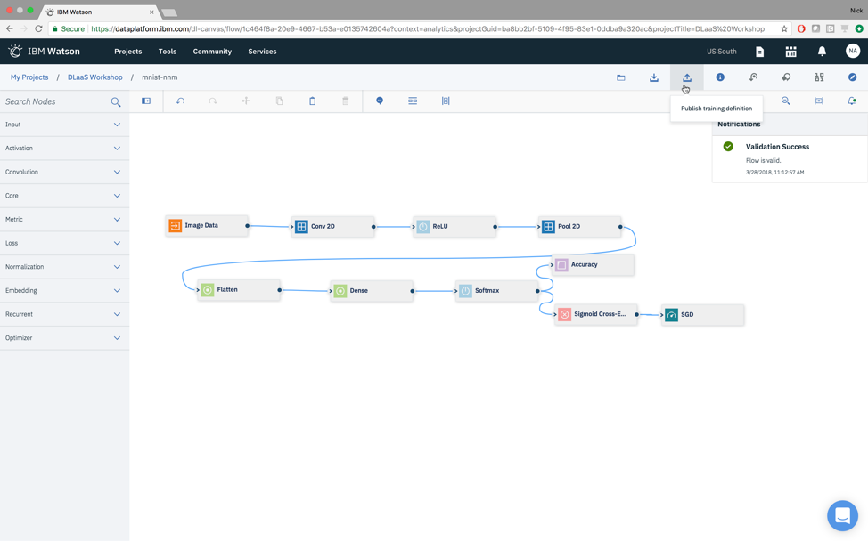 | 
|:--:| 
| *All other nodes are left in default settings. The “Validation Success” notification should now be seen. Select “Publish training definition” in the top right.* |

|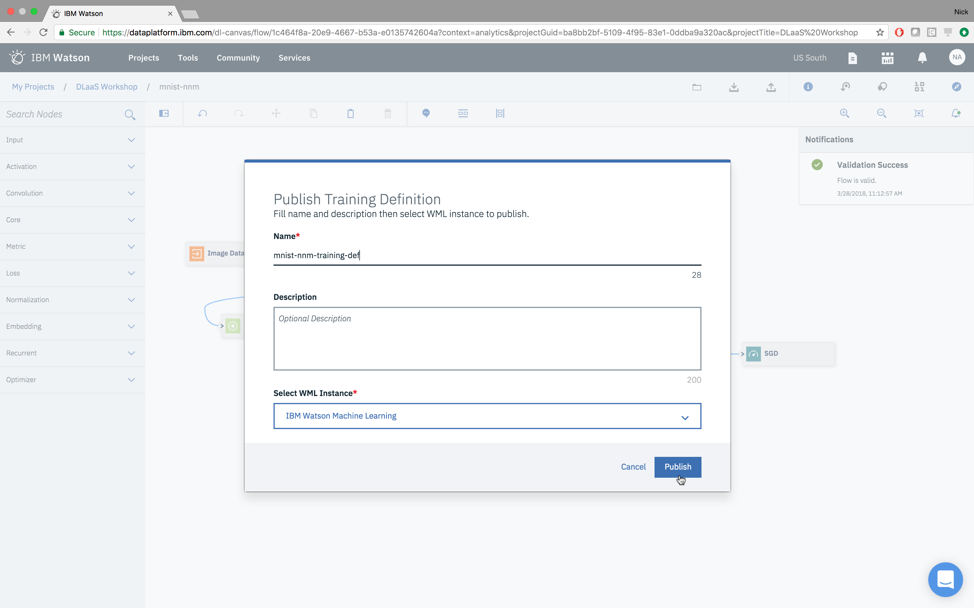 | 
|:--:| 
| *Name the training definition “mnist-nnm-training-def” and associate it with the WML instance.* |

| | 
|:--:| 
| *Once the training definition is successfully created, “train it in an experiment.”* |

| | 
|:--:| 
| *Name the experiment “mnist-nnm-experiment” and click “Select” under “Cloud Object Storage…”* |

| | 
|:--:| 
| *Select the “mnist-nnm-…” bucket containing training data. Create a new object storage bucket to store results. This has to be globally unique, so I added my last name. Then click “Select” at the bottom right.* |

| | 
|:--:| 
| *Select “1 X NVIDIA Tesla K80 (2 GPU)” as the Compute plan. Others are not available on the IBM Cloud Lite plan. Now click “Select.” The neural network will now begin training on the mnist data. As it is training continue to the next section.* |

### With Keras 
Under the assets section of the “DLaaS Workshop” project, add a new notebook, name it “mnist-hpo” and select from URL with the URL https://raw.githubusercontent.com/PubChimps/DLaaSWorkshop/master/mnist-hpo.ipynb

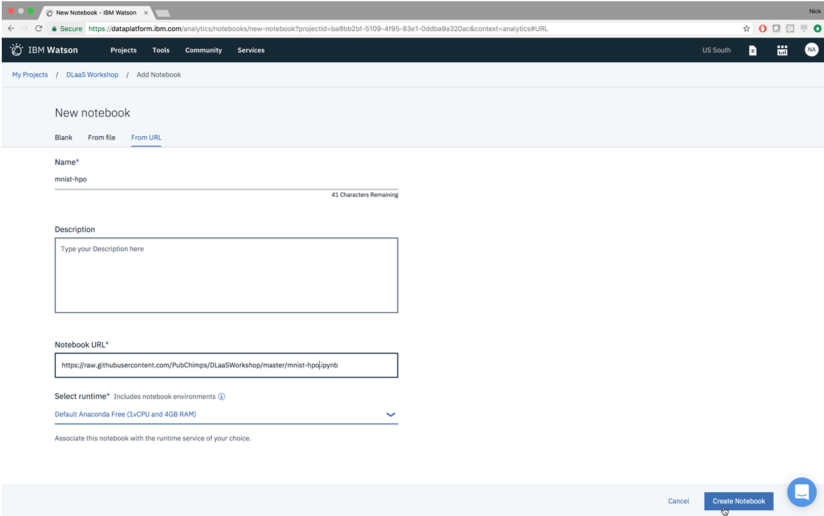

## Run Experiments 
### With Neural Network Modeler 
The experiment that was created in the previous section should be done training. Find “mnist-nnm-experiment” under the Experiments section of the “DLaaS Workshop” project. 

|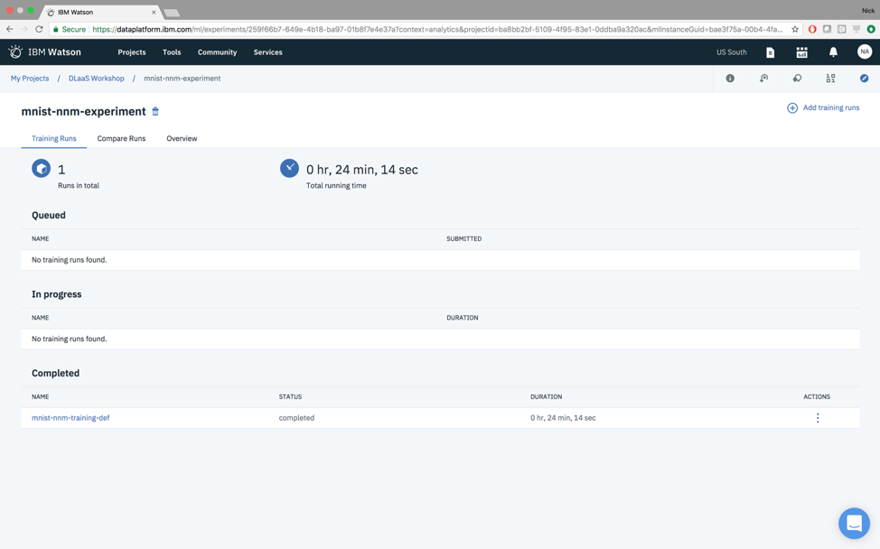 | 
|:--:| 
| *“mnist-nnm-training-def” should be in the Completed section. Its output logs can be view by selecting it.* |

### With Hyperparameter Optimization 
A new experiement will now be added to illustrate Watson Studio’s Hyperparameter Optimization. Select “New experiment” in the assets section of the “DLaaS Workshop,” name the new experiment “mnist-hpo-experiment” and click “Select.”

 
|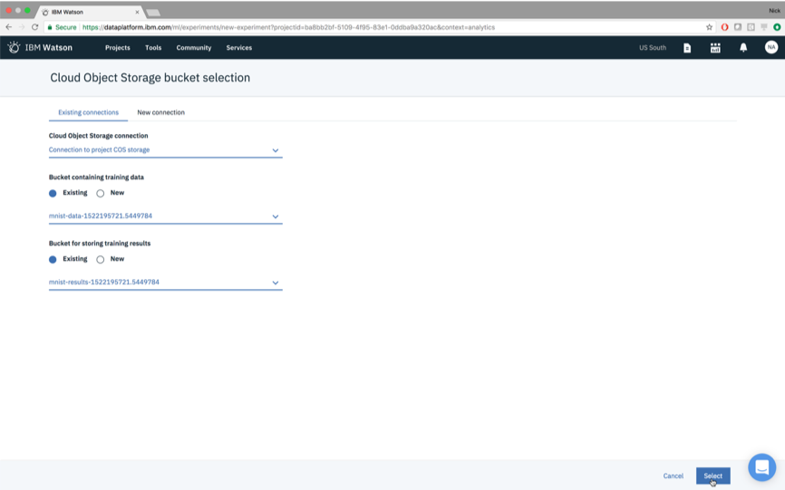 | 
|:--:| 
| *The buckets that were created in part 2 of “AddMnistData.ipynb” will be used here* |

|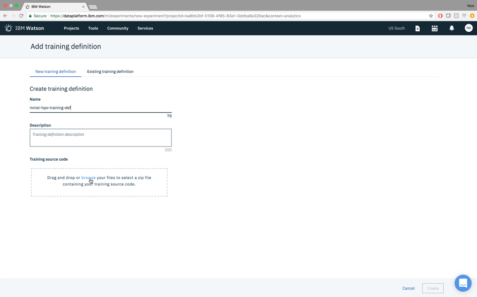 | 
|:--:| 
| *Name the new training definition “mnist-hpo-training-def” and upload “MNIST.ZIP” from the DLaaSWorkshop repository on GitHub. This contains the model written in Keras earlier, as well as other code.* |

|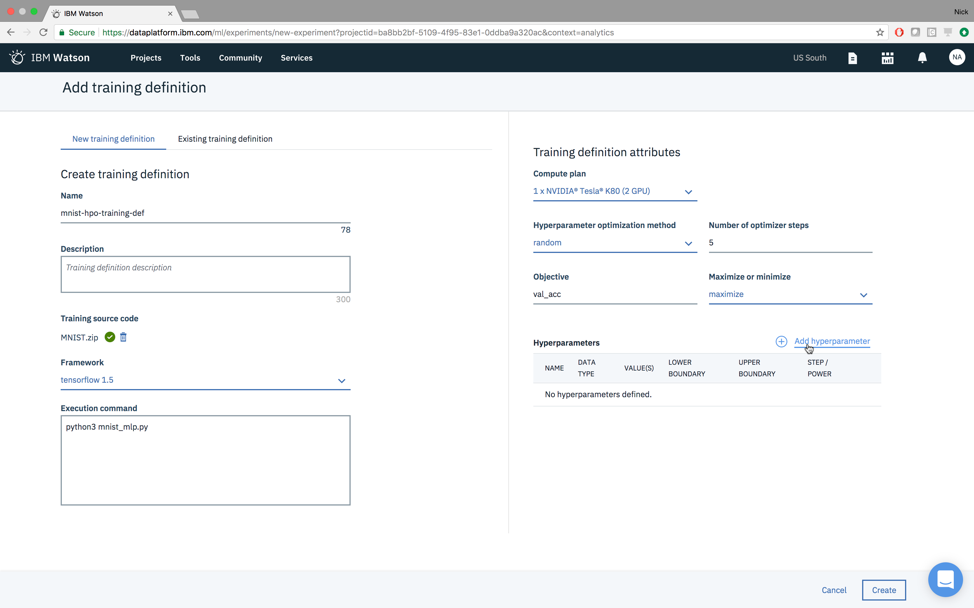 | 
|:--:| 
| *Choose the Framework and Execution command illustrated above, the same Compute plan from earlier, and “random” as the Hyperparameter optimization method, fill out the rest of the page as follows before selecting “Add Hyperparamter”* |

|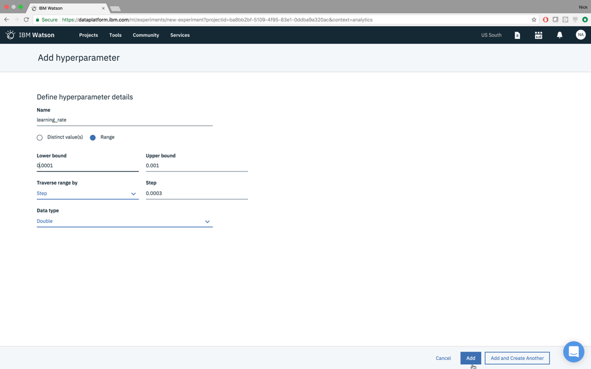 | 
|:--:| 
| *Instruct Watson Studio to vary the hyperparameter “learning_rate” as follows.* |

|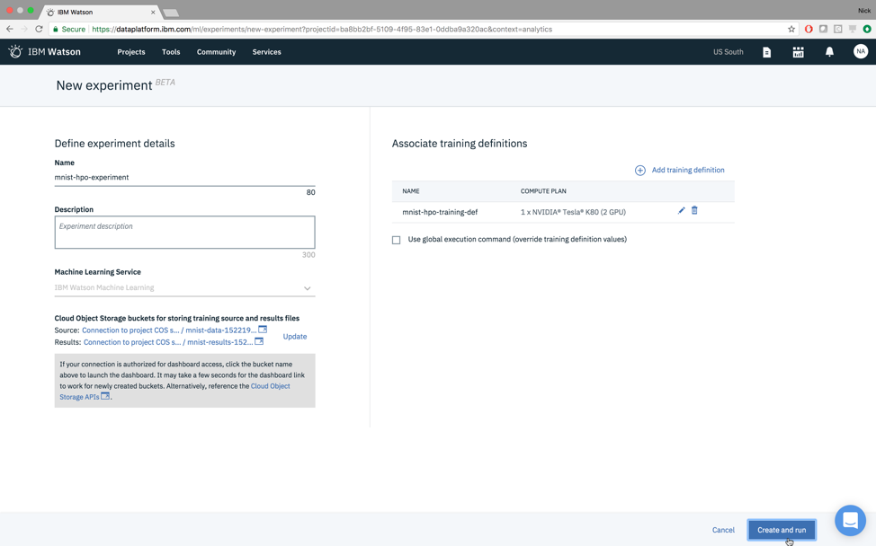 | 
|:--:| 
| *The experiment is ready. Select “Create and run”* |

