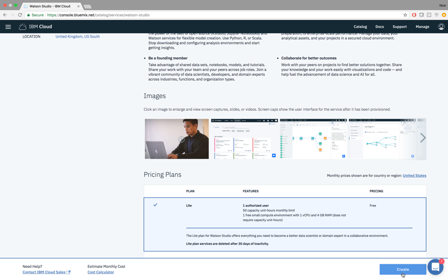
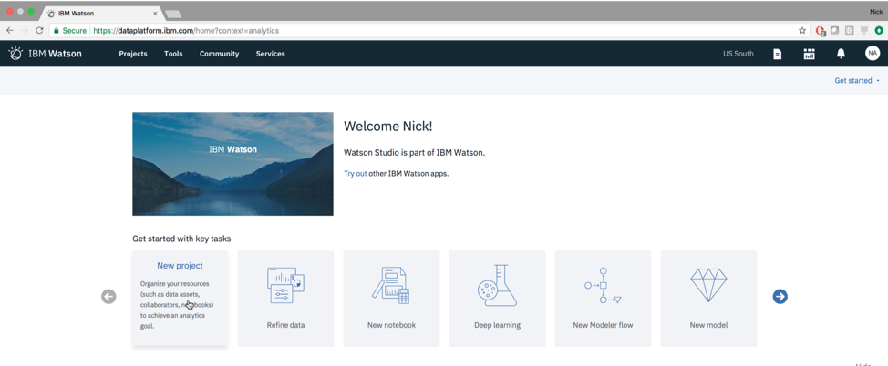
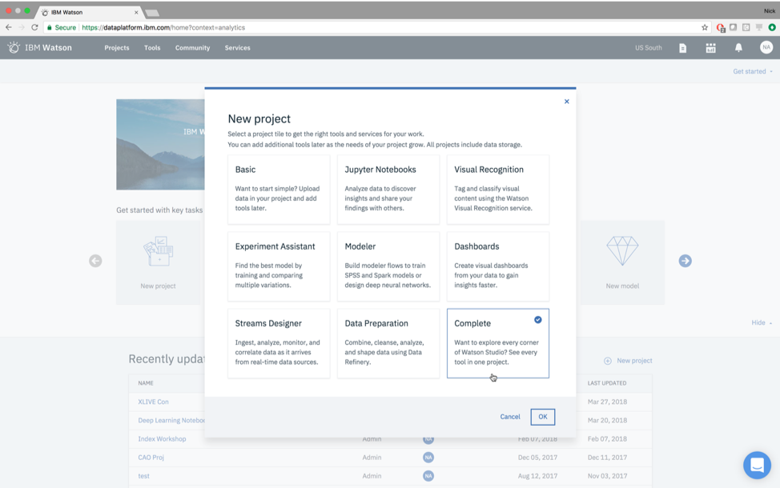
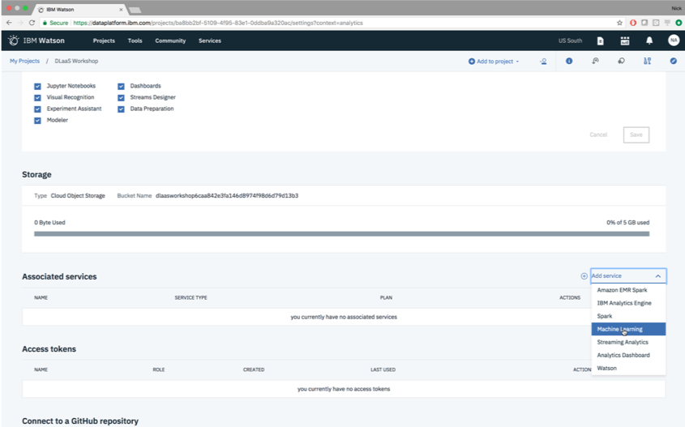

# DLaaSWorkshop
# Table of Contents
1. [Provision IBM Cloud Services](#provision)
2. [Create Watson Studio Project / Connect Services](#create)
3. [Add Data](#add)
4. [Build Neural Networks](#build)
	1. [With Neural Network Modeler](#wnnm1)
	2. [With Keras](#wkeras)
5. [Run Experiments](#run)
	1. [With Neural Network Modeler](#wnnm2)
	2. [With Hyperparameter Optimization](#whpo)

## Provision IBM Cloud Services  

Sign into IBM Cloud to see the welcome page below. New services are provisioned by selecting “Catalog.” Search for and select “Watson Studio.”

 

Make sure that a Lite plan is being selected for all services. Click “Create,” then search for and Lite “Machine Learning” and “Object Storage” services in the Catalog. Once finished, the IBM Cloud logo in the top left should bring you to a page shown below.

## Create Watson Studio Project / Connect Services 

Now a new Watson Studio Project will be created that utilizes all the IBM Cloud services just provisioned. Access Watson Studio by selecting the created Watson Studio service from the IBM Cloud dashboard, then select “Get Started” and “New project” on the right. The type of project needed is “Complete.”

Name the new project “DLaaS Workshop.” The IBM Cloud Object Storage service that was provisioned is already associated with our project. Select “Create” at the bottom right.

Once the new project is created, select “Settings” in the far-right menu. Scroll down until “Associated services” is visible and under “Add service” select “Machine Learning” to add the existing Watson Machine Learning service that was provisioned. New all over our services are associated with each other in our Watson Studio project and are ready for Deep Learning models.

## Add Data 

Buckets will now be created in the IBM Cloud Object storage service to so that the mnist training data and the results of deep learning training algorithms can be stored. The data is loaded in two different formats, demonstrated in “AddMNistData.ipynb”. Under assets, we will add a “New notebook” and point it to the notebook hosted on GitHub while keeping the default runtime already specified.

 

## Build Neural Networks 

Two neural networks will be created, a convolutional neural network (cnn) by using Watson Studio’s Neural Network Modeler along with a multilayer perceptron (mlp) in Keras.

### With Neural Network Modeler 
The steps to create a cnn using Neural Network Modeler are shown in the following annotated images.

|  | 
|:--:| 
| *In the “Assets” section of the “DLaaS Workshop” project, scroll and select “New Flow” from “Modeler flows”* |

|  | 
|:--:| 
| *Name the new model “mnist-nnm” and select “Neural Network Modeler” as the flow type. Then select “Create”* |

|  | 
|:--:| 
| *Use the Palette to the left to add the 10 neural network nodes shown above and connect them as follows.* |

Now the nodes must be configured for our mnist data, a node’s settings are visible by double-clicking it or selecting ⋮ then “open.”

| | 
|:--:| 
| *Edit the “Data” section to point to the pickle object that were created and stored in the mnist-nnm-… bucket from our Notebook, then select “Settings”* |

### With Keras 

## Run Experiments 
### With Neural Network Modeler 
### With Hyperparameter Optimization 
  
